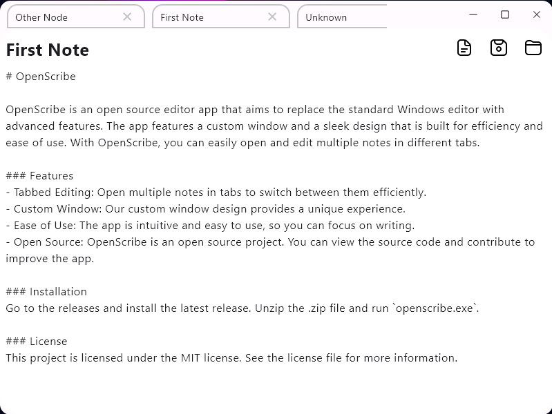

# OpenScribe

OpenScribe is an open source editor app that aims to replace the standard Windows editor with advanced features. The app features a custom window and a sleek design that is built for efficiency and ease of use. With OpenScribe, you can easily open and edit multiple notes in different tabs.

### Features
- Tabbed Editing: Open multiple notes in tabs to switch between them efficiently.
- Custom Window: Our custom window design provides a unique experience.
- Ease of Use: The app is intuitive and easy to use, so you can focus on writing.
- Open Source: OpenScribe is an open source project. You can view the source code and contribute to improve the app.

### Installation
Go to the releases and install the latest release. Unzip the .zip file and run `openscribe.exe`.

### License
This project is licensed under the MIT license. See the license file for more information.