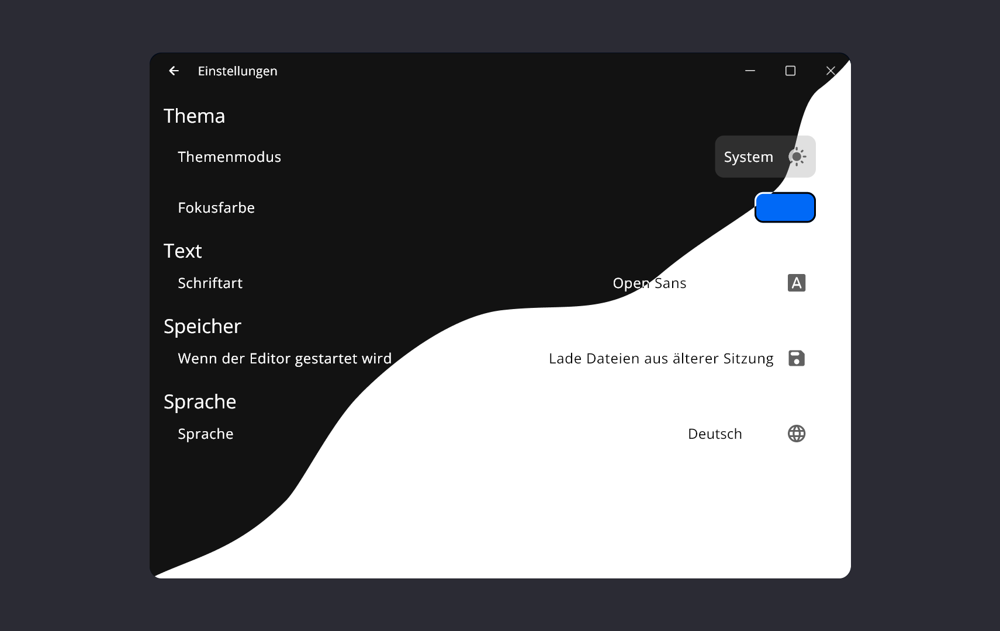

# OpenScribe

OpenScribe is an open source editor app that aims to replace the standard Windows editor with advanced features.

### Features
- Tabbed Editing 🚀: Open multiple notes in tabs to switch between them efficiently.
- Customizable User Experience 🎨: a custom window, custom colors, light and daak mode, and multiple fonts for a unique user experience.
- Shortcuts ⌨️: OpenScribe has a built-in keyboard shortcut to get work done.
- Ease of Use 🌟: The app is intuitive and easy to use, so you can focus on writing.
- Multiple Languages 🌍: OpenScribe is translated into multiple languages.
- Fast 🏃‍♂️: OpenScribe has a fast startup time and is lightweight.
- Open Source 📜: OpenScribe is an open source project. You can view the source code and contribute to improve the app.

### Installation
Go to the releases and install the latest release. Unzip the .zip file and run `openscribe.exe`.

### Usage
- Create a new document with `Ctrl + N` or go to `File -> New document`
- Open an existing document with `Ctrl + O` or go to `File -> Open`
- Save the document with `Ctrl + S` or save as with `Ctrl + Shift + S`
- Switch between tabs with `Ctrl + Tab` or click on the tab
- Zoom in with `Ctrl + Plus`, zoom out with `Ctrl + Minus`, reset with `Ctrl + 0` or go to `View -> ...`
- Open settings with `Ctrl + ,` or click on the top right settings icon
- Get information about the with the info icon on the top right under the settings icon, hover over it to get the information
- Print the document with `Ctrl + P` or go to `View -> Print`
- Quit the app with `Ctrl + Q`

- #### Note
    - When changing to light mode, probably you have to adjust the primary color setting

### License
This project is licensed under the MIT license. See the license file for more information.